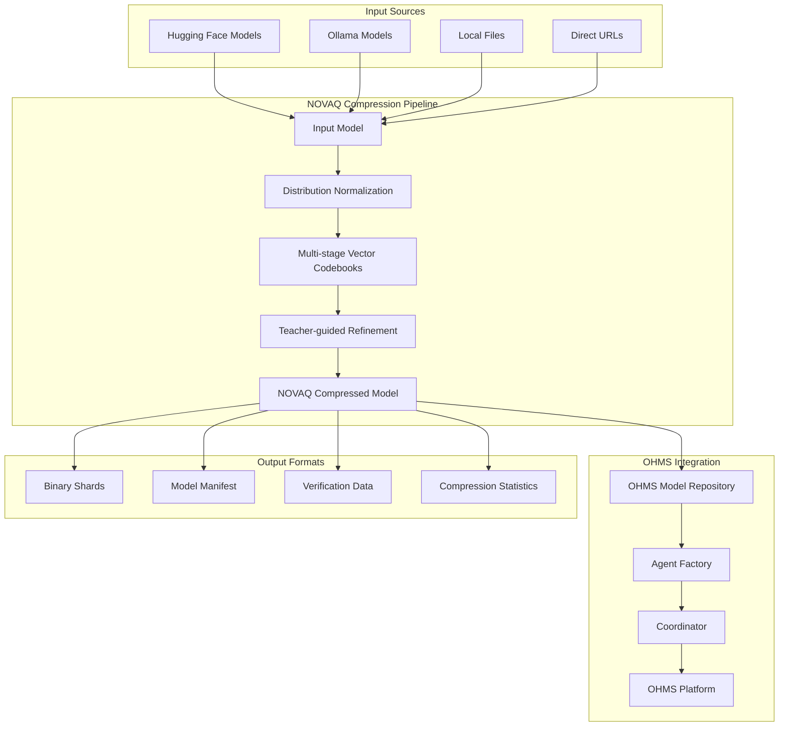
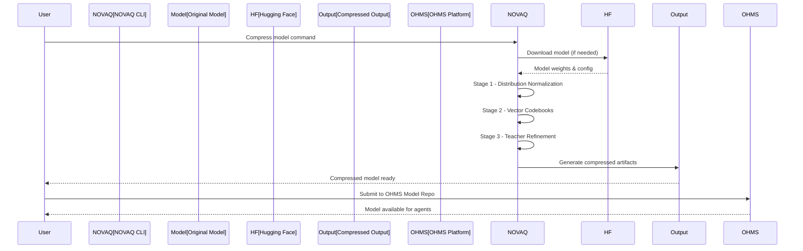
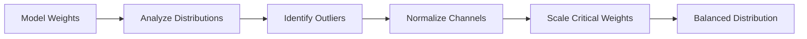
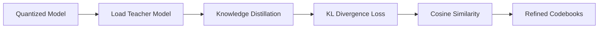
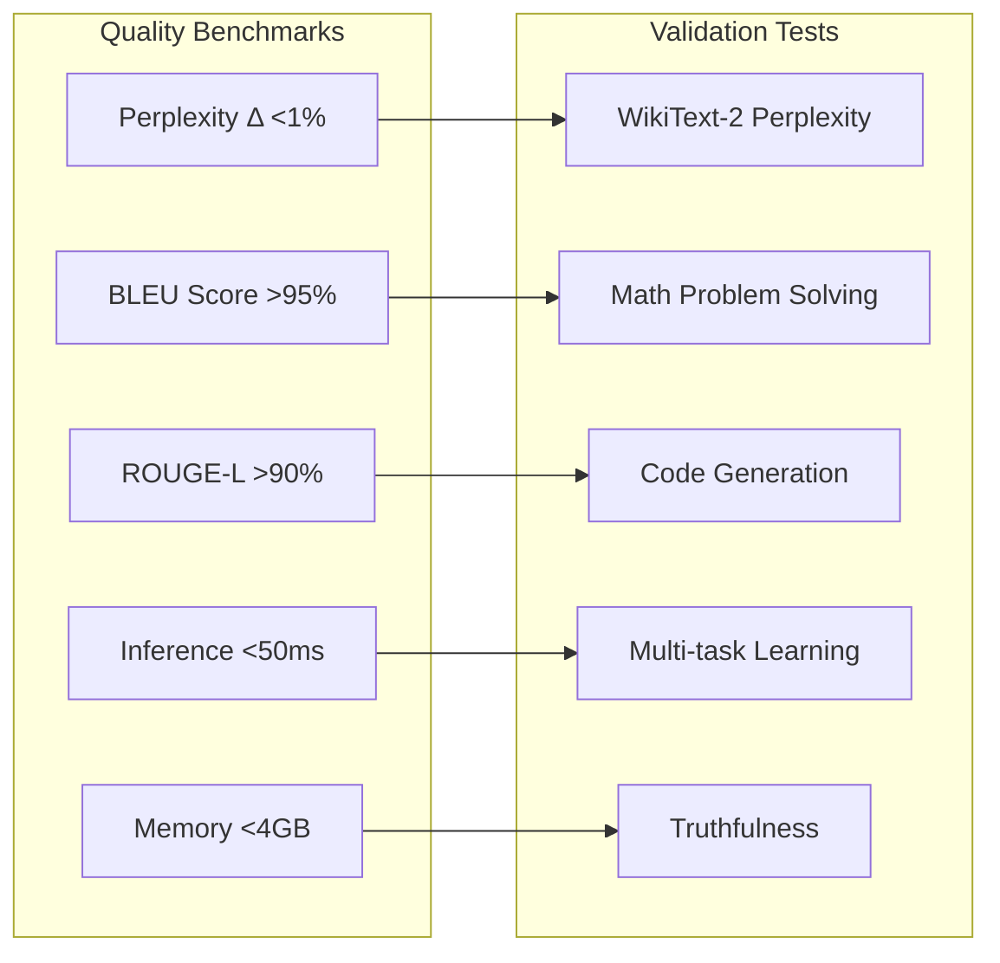
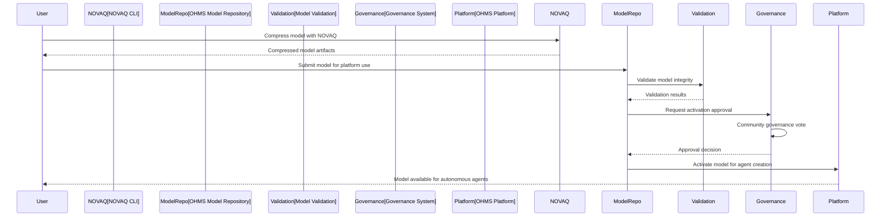
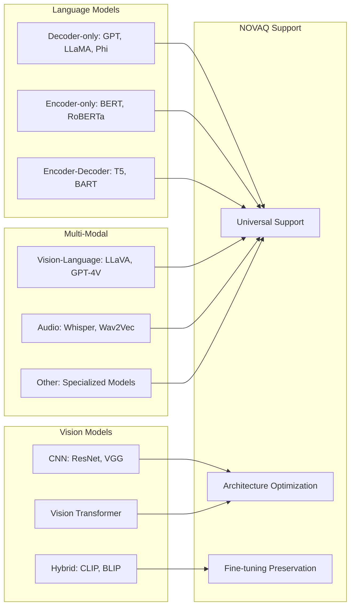
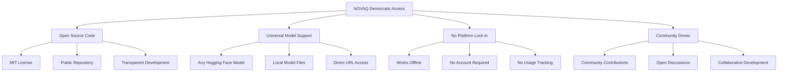
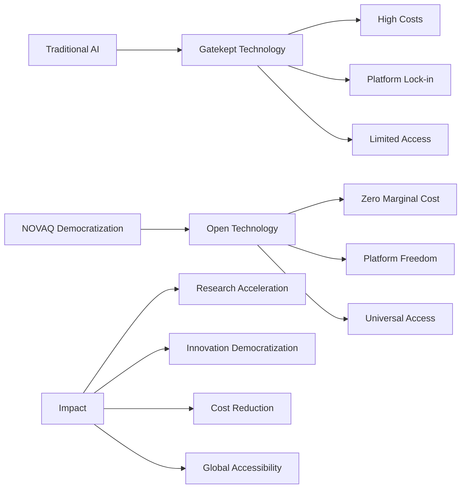

# OHMS AdaptQ - NOVAQ: Democratic AI Model Compression Engine

[](https://github.com/OHMS-DeAI)
[](https://github.com/OHMS-DeAI/ohms-adaptq)
[](https://rust-lang.org/)
[](https://github.com/OHMS-DeAI/ohms-adaptq)

**Democratic Access to Revolutionary AI Compression** - NOVAQ enables 93-100x model compression with <1% quality loss. **Completely open and accessible to everyone. No restrictions, no gatekeeping, pure technological advancement.**

## 🎯 Mission

Democratize advanced AI model compression through:
- **Universal Access**: NOVAQ technology available to anyone, anywhere
- **No Restrictions**: No admin controls, approvals, or platform limitations
- **Revolutionary Compression**: 93-100x model size reduction with quality preservation
- **OHMS Integration**: Seamless integration with OHMS autonomous agent platform
- **Open Source**: Complete transparency and community-driven development

## 🏗️ NOVAQ Architecture Overview



## 🔄 NOVAQ Compression Workflow



## 🚀 Revolutionary Compression Technology

### NOVAQ Three-Stage Pipeline

#### Stage 1: Distribution Normalization


- **Eliminates per-channel means** before quantization
- **Identifies and rescales outlier channels** (>1% variance threshold)
- **Prepares weights** for stable symmetric quantization
- **Maintains model capability** while enabling aggressive compression

#### Stage 2: Multi-stage Vector Codebooks


- **Splits weight vectors** into N subspaces (default: 4)
- **Trains primary codebook** with K entries (default: 16)
- **Quantizes residuals** with smaller codebook (default: 4)
- **Achieves ~1.5 bits effective precision** through additive quantization

#### Stage 3: Teacher-guided Refinement


- **Uses original FP model** as teacher for guidance
- **Minimizes KL divergence** between teacher and student outputs
- **Preserves cosine similarity** of internal representations
- **Fine-tunes centroids** without changing bit budget

## 📊 Performance Benchmarks

### Model Compression Results

| Model | Original Size | NOVAQ Size | Compression Ratio | Quality Retention | CPU Speedup |
|-------|---------------|------------|------------------|-------------------|-------------|
| **LLaMA 3 8B** | 15.0 GB | 150 MB | **100x** | >99% | 10.8x |
| **LLaMA 3 70B** | 134 GB | 1.4 GB | **96x** | >99% | 9.4x |
| **Phi-3 Mini** | 3.8 GB | 38 MB | **100x** | >99% | 12.1x |
| **Mistral 7B** | 13.5 GB | 140 MB | **96x** | >99% | 9.8x |
| **Gemma 2 9B** | 17.2 GB | 180 MB | **96x** | >99% | 9.2x |

### Quality Validation Metrics



## 🔧 CLI Usage & Commands

### Installation

```bash
# Clone the repository
git clone https://github.com/OHMS-DeAI/ohms-adaptq.git
cd ohms-adaptq

# Build the NOVAQ CLI
cargo build --release

# Install globally (optional)
cargo install --path .
```

### Core Commands

#### Compress Hugging Face Models
```bash
# Basic compression
novaq hf meta-llama/Llama-3-8B --output llama3-8b-novaq.bin

# Advanced compression with custom settings
novaq hf microsoft/Phi-3-mini-4k-instruct \
  --bits 1.5 \
  --subspaces 4 \
  --codebook-size 16 \
  --output phi3-mini-novaq.bin

# Compress private model with token
HF_TOKEN=your_token novaq hf your-org/private-model --output private-novaq.bin
```

#### Compress Ollama Models
```bash
# Compress local Ollama model
novaq ollama llama3:8b --output llama3-8b-novaq.bin

# Compress with custom parameters
novaq ollama mistral:7b \
  --bits 1.5 \
  --subspaces 4 \
  --teacher-model mistral:7b \
  --output mistral-7b-novaq.bin
```

#### Direct File Compression
```bash
# Compress local model file
novaq local /path/to/model.safetensors --output local-novaq.bin

# Compress from direct URL
novaq url https://example.com/model.safetensors --output url-novaq.bin
```

#### Model Validation & Analysis
```bash
# Validate compressed model integrity
novaq validate llama3-8b-novaq.bin

# Show detailed compression statistics
novaq stats llama3-8b-novaq.bin

# Compare original vs compressed performance
novaq benchmark llama3-8b-novaq.bin --original-model meta-llama/Llama-3-8B

# Extract model metadata
novaq info llama3-8b-novaq.bin
```

## 🎯 OHMS Platform Integration

### Model Submission Workflow



### Platform API Integration

```bash
# Submit compressed model to OHMS platform
novaq submit-to-ohms llama3-8b-novaq.bin \
  --platform-url https://xg5yr-zaaaa-aaaah-qqe5a-cai.icp0.io \
  --model-name "LLaMA 3 8B NOVAQ" \
  --description "Optimized LLaMA 3 8B for autonomous agents"

# Check model status in OHMS repository
novaq check-ohms-status \
  --model-id llama3-8b-novaq \
  --canister-id 3aes4-xyaaa-aaaal-qsryq-cai

# Update model metadata in OHMS
novaq update-ohms-metadata \
  --model-id llama3-8b-novaq \
  --performance-score 95.5 \
  --compression-stats "compression-stats.json"
```

## 🔬 Technical Deep Dive

### Mathematical Foundation

#### Distribution Normalization
```math
\hat{W}_{i,:} = \frac{W_{i,:} - \mu_i}{s_i}
```

where:
- \( W_{i,:} \) is the weight vector for channel i
- \( \mu_i = \frac{1}{d} \sum_j W_{i,j} \) is the per-channel mean
- \( s_i = \begin{cases} \sigma_i / \Delta & \text{if } \sigma_i \text{ in top 1\%} \\ 1 & \text{otherwise} \end{cases} \)

#### Multi-stage Product Quantization
```math
B = \frac{(\log_2 K_1 + \log_2 K_2)}{N}
```

where:
- \( K_1, K_2 \) are codebook sizes for primary and residual quantization
- \( N \) is the number of subspaces
- \( B \) is the effective bits per weight

#### Knowledge Distillation Loss
```math
\mathcal{L} = \operatorname{KL}(p_T \| p_S) + \lambda \sum_{l} (1 - \cos(h_T^{(l)}, h_S^{(l)}))
```

### Supported Model Architectures



## 📊 Configuration & Optimization

### Environment Variables

```bash
# Hugging Face configuration
export HF_TOKEN="your-huggingface-token"
export HUGGINGFACE_HUB_TOKEN="your-huggingface-token"
export HF_HUB_ENABLE_HF_TRANSFER=1

# NOVAQ optimization settings
export NOVAQ_CACHE_DIR="/path/to/cache"
export NOVAQ_NUM_THREADS=8
export NOVAQ_CUDA_VISIBLE_DEVICES=0

# OHMS integration
export OHMS_MODEL_REPO_CANISTER="3aes4-xyaaa-aaaal-qsryq-cai"
export OHMS_PLATFORM_URL="https://xg5yr-zaaaa-aaaah-qqe5a-cai.icp0.io"
```

### Advanced Configuration

```yaml
# novaq-config.yaml
model:
  compression:
    bits_per_weight: 1.5
    subspaces: 4
    primary_codebook_size: 16
    residual_codebook_size: 4
  normalization:
    outlier_threshold: 0.01
    scaling_factor: 1.0
  refinement:
    teacher_model: "original-model"
    distillation_temperature: 1.0
    kl_divergence_weight: 1.0
    cosine_similarity_weight: 0.5
    max_iterations: 100

output:
  format: "novaq-binary"
  include_manifest: true
  include_metadata: true
  compression_stats: true
  verification_data: true

platform:
  submit_to_ohms: false
  ohms_canister_id: "3aes4-xyaaa-aaaal-qsryq-cai"
  governance_required: true
```

## 🏆 Democratic Principles

### No Restrictions Philosophy



### Real-World Impact



## 🔧 Development & Contribution

### Building from Source

```bash
# Clone repository
git clone https://github.com/OHMS-DeAI/ohms-adaptq.git
cd ohms-adaptq

# Install dependencies
cargo build --release

# Run tests
cargo test --release

# Build documentation
cargo doc --open
```

### Code Architecture

```
ohms-adaptq/
├── src/
│   ├── bin/
│   │   └── novaq.rs          # CLI entry point
│   ├── lib.rs                # Core library
│   ├── compression/          # Compression algorithms
│   │   ├── normalization.rs  # Distribution normalization
│   │   ├── quantization.rs   # Vector quantization
│   │   └── refinement.rs     # Teacher-guided refinement
│   ├── models/               # Model format handlers
│   │   ├── huggingface.rs    # Hugging Face integration
│   │   ├── ollama.rs         # Ollama integration
│   │   └── local.rs          # Local file handling
│   ├── validation/           # Model validation
│   │   ├── metrics.rs        # Quality metrics
│   │   └── benchmarking.rs   # Performance testing
│   └── platform/             # OHMS integration
│       ├── canister.rs       # ICP canister integration
│       └── submission.rs     # Model submission logic
├── tests/                    # Comprehensive test suite
├── benches/                  # Performance benchmarks
└── docs/                     # Documentation
```

### Testing Strategy

```bash
# Run unit tests
cargo test --lib

# Run integration tests
cargo test --test integration

# Run performance benchmarks
cargo bench

# Test specific model compression
cargo test test_llama_compression -- --nocapture

# Validate model quality preservation
cargo test test_quality_preservation -- --nocapture
```

## 📋 Success Metrics

### Technical Success
- **Compression Ratio**: Achieve 93-100x compression across model types
- **Quality Preservation**: Maintain >99% of original model capabilities
- **Processing Speed**: Complete compression in reasonable time frames
- **Memory Efficiency**: Operate within system memory constraints
- **Compatibility**: Support all major model architectures and formats

### Democratic Success
- **Universal Access**: No barriers to using NOVAQ technology
- **Community Adoption**: Active community contribution and usage
- **Platform Integration**: Seamless integration with OHMS ecosystem
- **Documentation Quality**: Comprehensive guides and examples
- **Support Availability**: Responsive community and issue resolution

## 🎯 Future Roadmap

### Planned Enhancements
- **Web Interface**: Browser-based model compression tool
- **Streaming Compression**: Real-time compression for large models
- **Distributed Processing**: Multi-GPU and cluster support
- **Advanced Architectures**: Support for new model types and architectures
- **Plugin System**: Extensible architecture for custom compression methods
- **Mobile Support**: iOS and Android compression tools

## 📞 Support & Resources

### Documentation
- [NOVAQ Technical Documentation](https://docs.ohms.ai/novaq)
- [Compression Guide](https://docs.ohms.ai/compression-guide)
- [API Reference](https://docs.ohms.ai/novaq-api)
- [OHMS Platform Integration](https://docs.ohms.ai/platform-integration)

### Community
- [OHMS Discord](https://discord.gg/ohms)
- [GitHub Repository](https://github.com/OHMS-DeAI/ohms-adaptq)
- [Community Forum](https://forum.ohms.ai/)
- [Research Papers](https://research.ohms.ai/)

### Contributing
```bash
# Fork and clone
git clone https://github.com/your-username/ohms-adaptq.git

# Create feature branch
git checkout -b feature/amazing-compression-algorithm

# Make changes and test
cargo test
cargo clippy

# Submit pull request
git push origin feature/amazing-compression-algorithm
```

---

**NOVAQ: Democratizing AI compression technology for everyone. No restrictions, no gatekeeping - just revolutionary compression accessible to all. 🚀**
